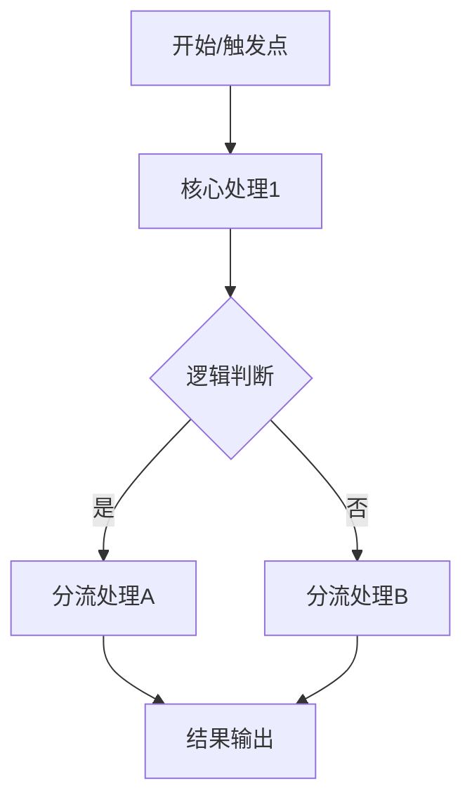

# [项目/文件名称] 代码分析报告

## 1. 概述 (Overview)

- **核心作用**：[简述代码的主要功能]
- **技术栈**：[列出主要技术, 如 Python 3.10, FastAPI, Redis]

## 2. 模块结构 (Module Structure)

| 模块名 | 核心职责 | 关键方法/接口 |
| :--- | :--- | :--- |
| [模块1] | [职责描述] | [方法名] |
| [模块2] | [职责描述] | [方法名] |

## 3. 核心逻辑链 (Logic Chain)

### 流程详解

1. **[步骤1]**: [详细描述]
2. **[步骤2]**: [详细描述]
3. **[步骤3]**: [详细描述]

## 4. 依赖与调用关系 (Dependencies)

- **内部依赖**: [描述各本地模块间的耦合关系]
- **外部依赖**: [列出主要第三方库]

## 5. 设计亮点与建议 (Insights)

- [亮点1]
- [优化建议1]
